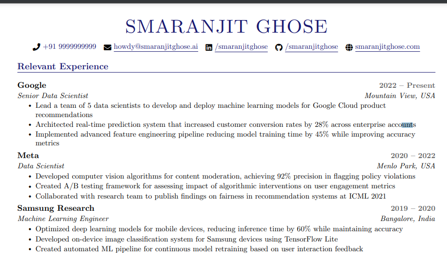

# Smaran Resume✨

[](https://github.com/smaranjitghose/SmaranResume/stargazers)
[](https://github.com/smaranjitghose/SmaranResume/network/members)
[](https://github.com/smaranjitghose/SmaranResume/issues)
[](https://github.com/smaranjitghose/SmaranResume/blob/main/LICENSE)


A professional, modern LaTeX resume template designed specifically for developers and tech professionals. Features clean typography, smart section organization, and ATS-friendly formatting.



## Table of Contents 📚

1. [Features](#features)
2. [Preview](#preview)
3. [Getting Started](#getting-started)
   - [Option 1: VS Code](#option-1-vs-code)
   - [Option 2: Overleaf](#option-2-overleaf)
4. [Customization](#customization)
5. [Troubleshooting](#troubleshooting)
6. [Contributing](#contributing)
7. [License](#license)


## Note 📝

All information provided in this template is for placeholder purposes only and should be replaced with your own details. The content may not be completely related to me or reflect my personal experience

## Features ✨

### Core Design
- **Minimalist Two-Column Layout** (11pt base font size)
- **Navy/Indigo Color Scheme** (RGB: 25, 25, 112)
- **Compact Vertical Spacing** (Optimized for 1-page resumes)

### Technical Features
- **Font Awesome 5 Integration** (1,500+ icons)
- **Hyperlinked Contact Info** (Email, LinkedIn, GitHub, Portfolio)
- **ATS-Optimized Structure** (Machine-readable PDF output)
- **Custom LaTeX Commands** for simplified editing

### Content Sections
```latex
\section{Relevant Experience}       % With subheadings and bullet points
\section{Teaching Experience}      % Academic/mentorship roles
\section{Technical Skills}         % Multi-column format
\section{Open Source Contributions} % With project links
\section{Publications}             % Academic works
\section{Awards}                   % Honors & achievements
```

## Preview 🖼️
The PDF generated out of the latest version of the code can be found [here](./output/Smaran_Resume.pdf)

## Getting Started 🚀

### Step 1: Get the Template
**Choose either method:**

#### Method A: Clone (Recommended)
```bash
git clone https://github.com/smaranjitghose/SmaranResume.git
cd SmaranResume
```

#### Method B: Download ZIP
1. Click "Code" → "Download ZIP" on GitHub  
2. Extract to your preferred location

### Option 1: VS Code 🖥️  
**For power users with local LaTeX setup**

1. **Install Prerequisites**:
   - [VS Code](https://code.visualstudio.com/) + [LaTeX Workshop](https://marketplace.visualstudio.com/items?itemName=JamesYu.latex-workshop)
   - LaTeX distribution ([MiKTeX](https://miktex.org/) (Windows) / [MacTeX](https://www.tug.org/mactex/) (macOS))

2. **Edit & Build**:
   ```bash
   code .
   ```
   - Modify `main.tex`
   - `Ctrl+Shift+P` → "Build LaTeX project"

3. **Output**:  
   Generated `main.pdf` appears in the project folder

### Option 2: Overleaf ☁️  
**For beginners & collaborative editing**

1. **Create Account**:  
   Sign up at [overleaf.com](https://www.overleaf.com)

2. **Upload Files**:
   - New Project → "Upload Project"  
   - Drag-and-drop all template files

3. **Compile**:
   - Edit `main.tex` directly in browser  
   - Click "Recompile"  
   - Download PDF when ready

## Customization 🛠️

### 1. Change Colors
```latex
\definecolor{maincolor}{RGB}{25,25,112}
\definecolor{datecolor}{RGB}{100,100,100}
```

### 2. Adjust Layout
```latex
\addtolength{\oddsidemargin}{-0.6in}
\addtolength{\topmargin}{-.7in}
```

### 3. Modify Sections
```latex
\resumeEducation
  {University Name}
  {Degree Name}
  {Location}
```

### 4. Technical Skills Format
```latex
\begin{itemize}[leftmargin=0.15in, label={}]
  \small{\item{
    \textbf{Languages}: Python, JavaScript, SQL \\
    \textbf{Frameworks}: React, TensorFlow, Django
  }}
\end{itemize}
```

## Troubleshooting 🐛

| Issue | Solution |
|-------|----------|
| Missing Font Awesome icons | Run `tlmgr install fontawesome5` |
| Overfull hbox warnings | Reduce text in bullet points |
| PDF not updating | Delete .aux files and recompile |
| Hyperlinks not working | Add `\hidelinks` to preamble |

## Contributing 🤝

1. Fork the repository  
2. Create a feature branch (`git checkout -b feature/improvement`)  
3. Commit changes (`git commit -m 'Add new section type'`)  
4. Push to branch (`git push origin feature/improvement`)  
5. Open a Pull Request

## License 📄
MIT License - See [LICENSE](LICENSE) for details.
